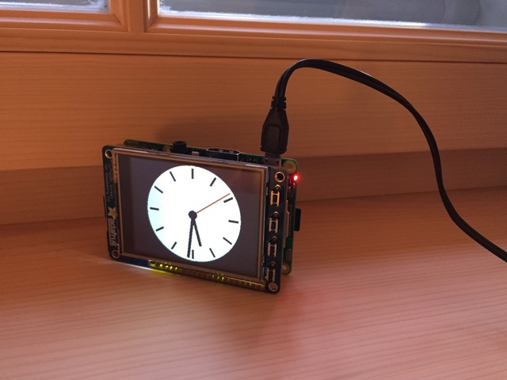

# piclock

A clock for Raspberry Pi with Adafruit PiTFT 2.8" screen. The project is written in Python, using pygame, rendering
directly to the framebuffer `/dev/fb0`. 

## Installation

Install the Adafruit screen as described [here](https://learn.adafruit.com/adafruit-pitft-28-inch-resistive-touchscreen-display-raspberry-pi/easy-install-2) and follow the directions for _PiTFT as Text Console (best for Raspbian 'Lite')_.

Run `poetry install` or install manually the dependencies listed in `pyproject.toml`

## Run

With poetry:
```
cd src/piclock
poetry run python3 main.py
```

With system python:
```
cd src/piclock
python3 main.py
```




## Troubleshooting

If you see an error like
```
Traceback (most recent call last):
  File "main.py", line 124, in <module>
    clock = PiClock(screen_width=320, screen_height=240, use_framebuffer=True)
  File "main.py", line 19, in __init__
    self.screen_resolution = (pygame.display.Info().current_w, pygame.display.Info().current_h)
pygame.error: video system not initialized
```
the current user account has not the permission to access the framebuffer. Try running the program with `sudo`.